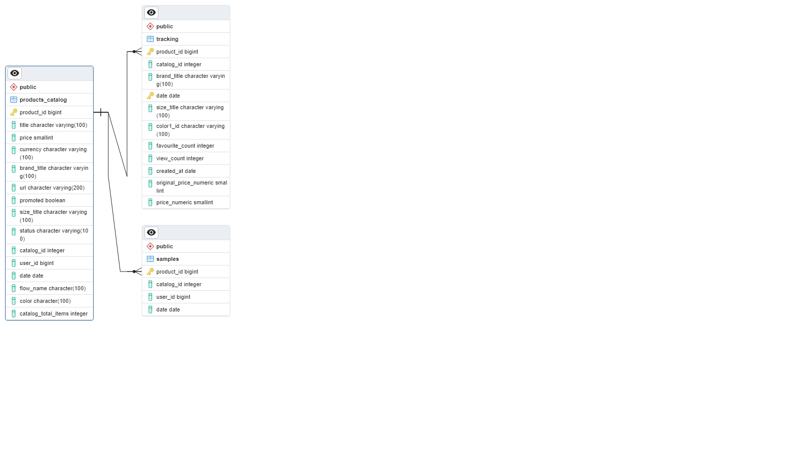
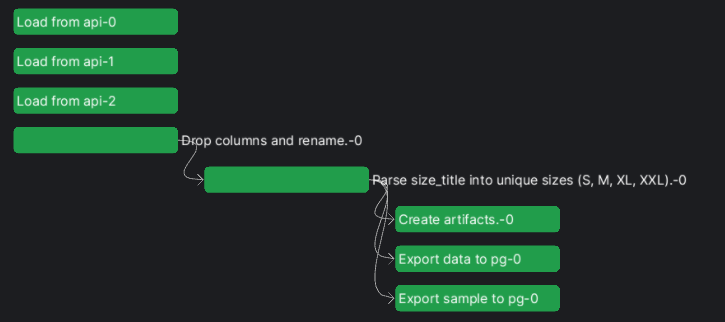
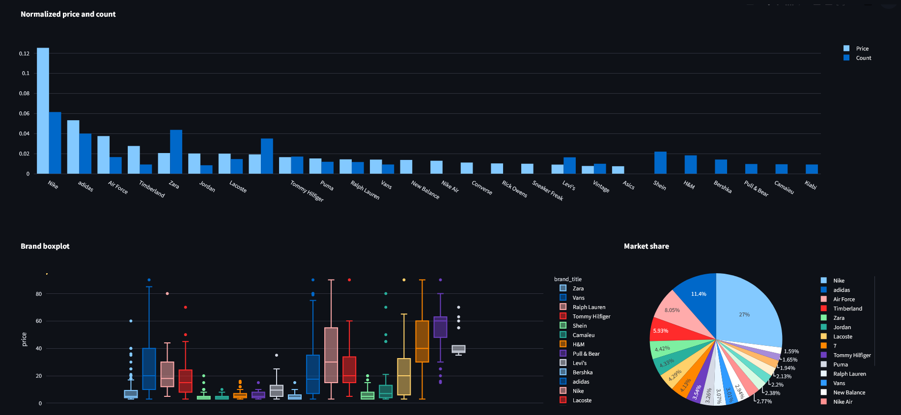
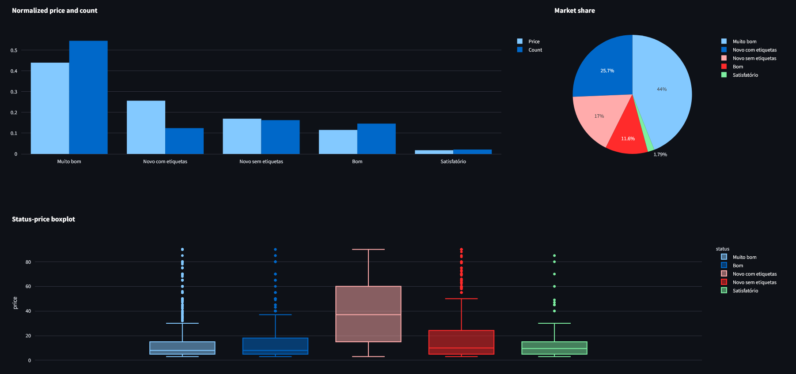
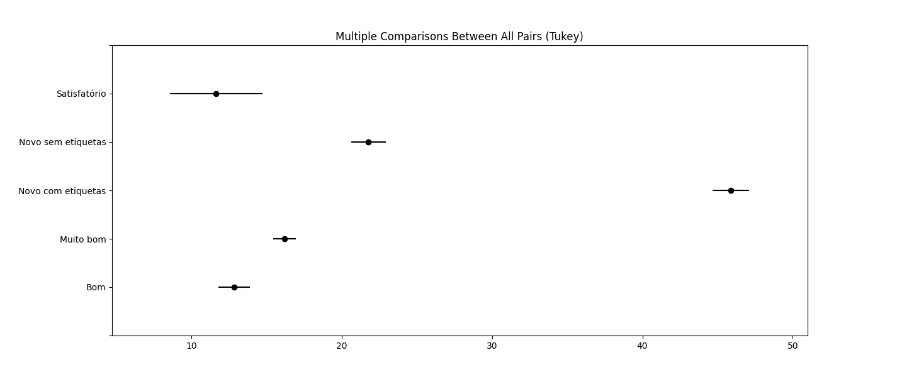
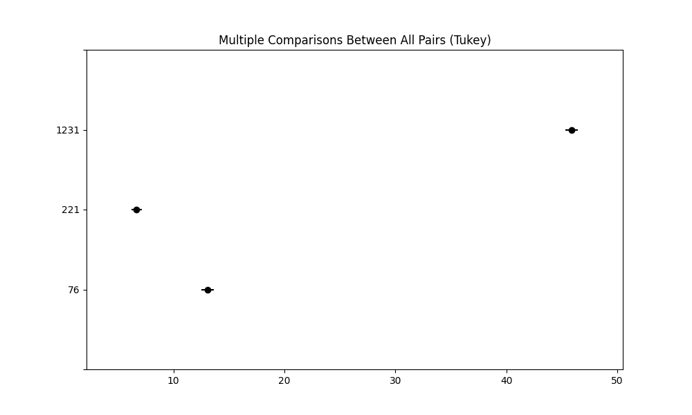
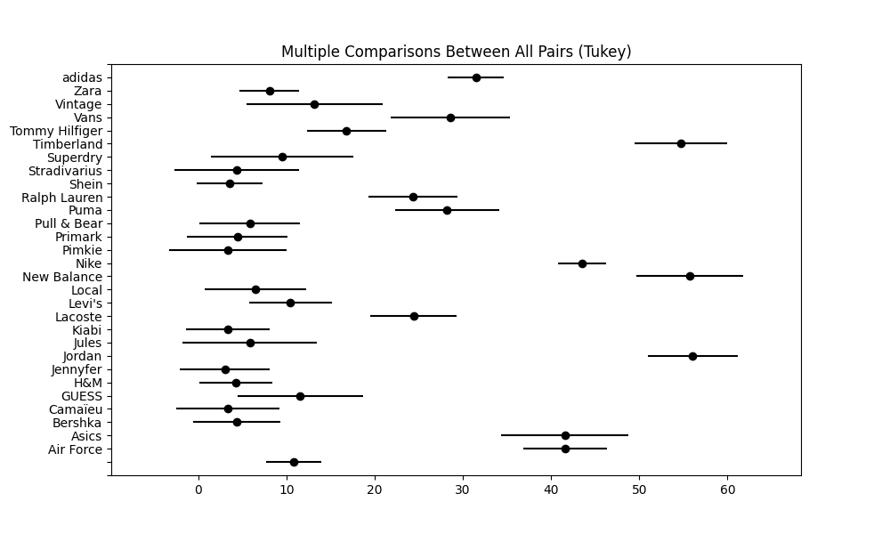
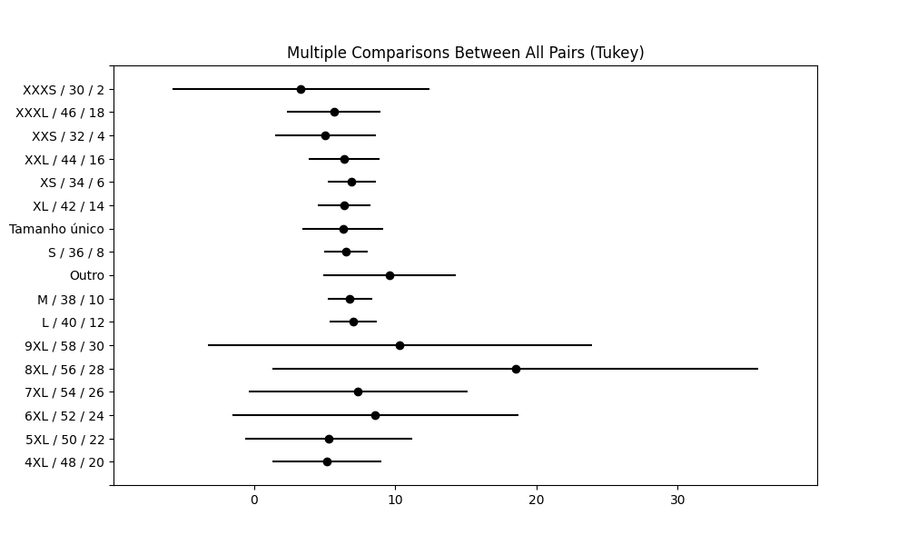
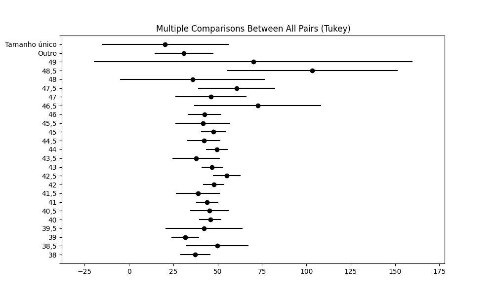

# Project Overview

The purpose of this project is to find key insights about data from Vinted which can help users to determine how to best sell their products. Some concerns users face when selling articles are:

##### Price concerns
- What are the price ranges for each article?
    -> price suggestion system based on size, status and brand, sampling and confidence intervals
        - suggestions based on price distribution and median prices
        - suggestions based on saleability metrics (not yet possible to implement)
- How article labels, such as size, brands and status relate to price dynamics?

##### Saleability concerns

- What's the current popularity for each article, brand and size?
- How to predict saleability given the input article labels?

##### Other

- Tracking data drift by monitoring flow metadata and Kullback-Leibler Divergence (difference between distributions accross timeframes)
    -> Tracking proportions in categorical variables
    -> Tracking KL divergence for numerical variables
- Price sensitivity to item condition per catalog

## Roadmap

### Todo Main Features

- [x] Create an API to connect to Vinted Endpoints 
- [x] Create a basic data pipeline with prefect and postgres
- [ ] Create a "Shoe or Clothing" binary label based on sizes
- [ ] Documentation
- [ ] Refactor tracking flow to schedule multiple subflows and use persistent results
- [ ] Cluster assessment of products in dashboard
- [ ] Use text tokens to predict prices (remove brand names)
- [ ] Cluster brand names by similarity (yeezy/adidas, nike/jordan, etc)

### Backlog

- [ ] Work on the dashboard
- [ ] Develop a pipeline to track saleability
- [ ] Develop a pipeline to track brand, catalog_id, colour statistics
- [ ] Cluster catalog_id's into groups
- [ ] Create dim tables for brands, sizes and colours
- [ ] Normalize the database
- [ ] Find a way to overcome API rate limits (currently implemented Exponential Backoff on requests)

### Main roadblocks

- Vinted API endpoints doesn't provide a direct way to get the brands, sizes, colours, gender, and status variables
- Vinted API frequently rate limits my requests
- Defining saleability. The default metrics vinted used are "views" and "likes". I propose the creation of another metrics, "mean-time-to-sale".

## Data Engineering

### Current Schema

##### Staging area

##### Staging workflows

1. Load raw data from api
2. Drop and rename columns
3. Format sizes into unique groups (ex. M / 36 / ... -> M)
4. TODO: Add row "is_sneaker" based on sizes
5. Export data:
    - Export prefect artifacts
    - Export data to pg
    - Export samples to pg

## Dashboard

Currently just a few descriptive simple graphs. No callback functions.

** Brands **

** Status **

## Findings

### How article status conditions price

Tukey HSD is often used as an extension of ANOVA (post-hoc test) to compare means between 2 groups. Caveat: does not take into account covariates (the effects of labels)
There is a significant difference between all groups except Bom Satisfatório. Makes sense to do HSD test per catalog.

**Tukeys HSD test**

| group1                  | group2                  | meandiff | p-adj | lower  | upper  | reject |
|-------------------------|-------------------------|----------|-------|--------|--------|--------|
| Bom                     | Muito bom               | 3.3741   | 0.0   | 1.6412 | 5.107  | True   |
| Bom                     | Novo com etiquetas      | 33.0584  | 0.0   | 30.7484| 35.3684| True   |
| Bom                     | Novo sem etiquetas      | 8.9344   | 0.0   | 6.7008 | 11.1679| True   |
| Bom                     | Satisfatório            | -1.1909  | 0.9339| -5.3086| 2.9269 | False  |
| Muito bom               | Novo com etiquetas      | 29.6843  | 0.0   | 27.7227| 31.646 | True   |
| Muito bom               | Novo sem etiquetas      | 5.5603   | 0.0   | 3.6893 | 7.4313 | True   |
| Muito bom               | Satisfatório            | -4.565   | 0.0134| -8.4979| -0.632 | True   |
| Novo com etiquetas      | Novo sem etiquetas      | -24.124  | 0.0   |-26.5394|-21.7087| True   |
| Novo com etiquetas      | Satisfatório            | -34.2493 | 0.0   |-38.4684|-30.0302| True   |
| Novo sem etiquetas      | Satisfatório            | -10.1253 | 0.0   |-14.303 |-5.9475| True   |

**Marginal gains:**

Bom -> Muito Bom = 3.4€ avg
Muito Bom -> Novo sem etiquetas = 5.5€
Nove sem etiquetas -> Novo com etiquetas = 24.1€

### How article catalog conditions price

**Tukeys HSD test**

| group1 | group2 | meandiff | p-adj | lower  | upper  | reject |
|--------|--------|----------|-------|--------|--------|--------|
|   76   |   221  |  -6.3822  |  0.0  | -7.4262| -5.3383|  True  |
|   76   |  1231  |  32.8322  |  0.0  | 31.7076| 33.9568|  True  |
|  221   |  1231  |  39.2144  |  0.0  | 38.1552| 40.2736|  True  |

**Difference between labels:**

76 (t shirts) -> 221 (women t shirts) = -6.4€ avg
76 (t shirts) -> 1231 (sneakers) = 33€
221 (women t shirts) -> 1231 (sneakers) = 39.2€

### How brand price conditions price (top 30 brands by listing frequency)

It's clear there are underlying covariate which explain the deviations between brands. For instance, knowing Timberland, New Balance and Jordan are mostly sneakers brands and sneakers have huge margins on other types of catalog items is very important to understand the deviations. This further emphasis the importance of domain knowledge in data science.

### How sizes condition price

#### Clothing

#### Shoes

