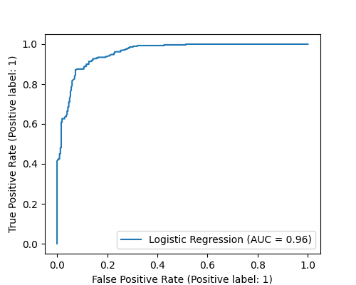
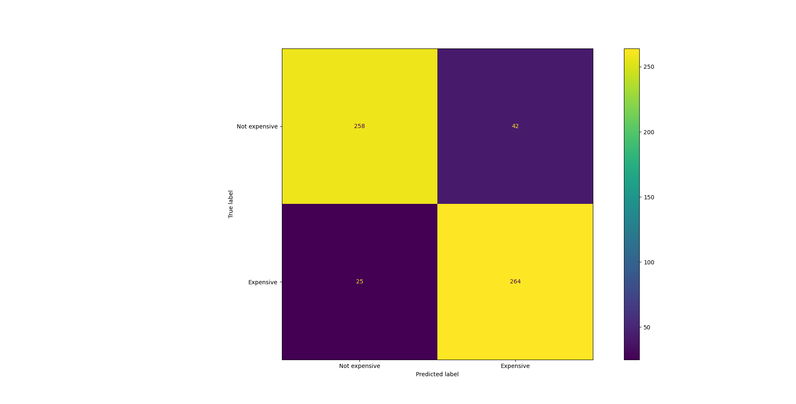

# Overview

This is a binary classification problem 0: Expensive, 1: Not Expensive. Each row is considered expensive if it belongs to quantile >85. As a result, this produces an imbalanced dataset which is easily fixed by considering the lower class approach.

### Workflow:

**Data Loading and Cleaning**: Extracting data from the PostgreSQL database, and handling missing or outlier values.

```python
sql_query = "SELECT * FROM public.products_catalog LIMIT 15000"
data = pd.read_sql(sql_query, engine)
```
**Outlier Detection with One-Class SVM**: Using a One-Class Support Vector Machine (SVM) to detect outliers in the 'price' column. This ensures a robust result.

```python
# nu param ensures that approx 10% of the training data can be classified as an outlier
# gamma is the sensivity of the rbf curve. gamma -> inf increases overfitting, lower values tend to produce less flexible decision boundaries
clf = svm.OneClassSVM(nu=0.1, kernel="rbf", gamma=0.1)
clf.fit(data["price"].values.reshape(-1, 1))
y_pred_train = clf.predict(data["price"].values.reshape(-1, 1))
data["svm"] = y_pred_train
data = data[data["svm"] == 1]
```

**Creating target variable**: Target variable is defined as "Expensive".
```python
data["target"] = data["price"].apply(lambda x: 1 if x > data["price"].quantile(0.85) else 0)
```

**Stratified Sampling**: Performing stratified sampling to balance the dataset.
```python
# data balancing
def stratified_sampling(group):
    return group.sample(min(len(group), target_sample_size), replace=False)

# Calculate the target sample size (assuming equal sizes for both classes)
target_sample_size = data['target'].value_counts().min()

# Apply the stratified sampling using groupby and apply
data = data.groupby('target', group_keys=False).apply(stratified_sampling)
```

**Feature Encoding**: Applying ordinal and one-hot encoding to categorical features such as 'status', 'size_title', 'brand_title', and 'catalog_id'. Note size_title, brand_title and catalog_id are one hot encoded because there is no ranking relationship between them. Status is ordinal encoded since there is a relationship between levels of item status.

**Model Training**: Training a logistic regression model with hyperparameter tuning using BayesSearchCV. The saga solver is around n_iters*f(n)**n_features and accepts both "l1", "l2" regularization. The training was done by using the training set to find the optimal "C" param and then cross_validation on the training data to optimize the feature weights hyperparams.
The classifier is a simple logit regression taking the feature space described above as input vector.

**Hyperparam tuning**: The param tuned is regularization factor C which is inverse to the cost function. Smaller values lead to stronger regularization since it leads to higher penalty. The penalty used here is by default "l2" regularization.

**Model Evaluation**: Evaluating the model's performance using various metrics such as ROC-AUC, specificity, recall, and accuracy. Cross validation functions supports multiple metrics to be computed at once and store in a dictionary for each run, however only one will be used as a criteria for Maximum Likelihood optimization. The purpose is to find the maximum value of ROC.

**Confusion Matrix and ROC Curve**: Visualizing the confusion matrix and ROC curve to assess classification performance.

**Model Serialization**: Saving the trained model using joblib to be used in model orchestration.

### Results:

##### Classification report

    |               | Precision | Recall | F1-Score | Support |
    |---------------|-----------|--------|----------|---------|
    | Not expensive |   0.91    |  0.86  |   0.89   |   300   |
    |   Expensive   |   0.86    |  0.91  |   0.89   |   289   |
    |   Accuracy    |           |        |   0.89   |   589   |
    |   Macro Avg   |   0.89    |  0.89  |   0.89   |   589   |
    | Weighted Avg  |   0.89    |  0.89  |   0.89   |   589   |

- True Positive Rate (Sensitivity or Recall): true positives/ total actual positives
- False Positive Rate: true negatives/ total actual negatives

##### ROC

AUC = 0.96 which is a very good score.

##### Confusion Matrix

Accuracy: 0.89 which is great.


### Takeaways:

- Sage is the general purpose solver which accepts all penalty functions and both 64 and 32 bits arrays.
- AUC measures the relationship between TPR and FPR so its the best all rounded solution for binary classification problems (considering these problems have a very robust conditioning). Examples of bad conditioned problems are skewed datasets, imbalanced classes, ambiguous labels, insufficient data (predictors).
- A way to improve training performance would be to limit the number of labels by introducing another preprocessing step of feature selection such as Recursive Feature Selection.

### Limitations:

- Because of data limitations and the way brands are encoded, the algorithm doesn't produce the same results for all brands. Example: its much more likely to produce a strong prediction with popular brands such as Nike or Ralph Lauren than local brands. One way to overcome this would be to subsample and remove any data points with unknown brands (with just a few entries) or relabel them.
